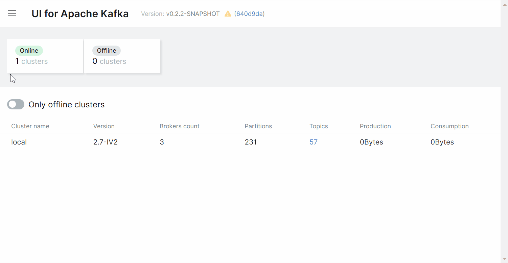

  <section class="hero-shell reveal is-visible">
    

      

        
Fork-owned documentation

        <h1 class="hero-title">Operate Kafka with a cleaner control surface.</h1>
        

          UI for Apache Kafka combines cluster visibility, topic tooling, auth controls, and message inspection
          in one place. This fork keeps the docs in the product repo, so deployment guidance, IAM support, and
          build instructions now move with the code instead of drifting in a separate docs system.
        

        

          <a class="md-button md-button--primary" href="overview/getting-started/">Start with Docker</a>
          <a class="md-button" href="configuration/authentication/aws-iam/">EKS and MSK IAM</a>
          <a class="md-button" href="configuration/compose-examples/">Compose lab files</a>
        

        

          Kafka 3.9.1 baseline
          JDK 21
          GHCR releases
          EKS to MSK IAM on 9098
        

      

      

        
        

          Cluster visibility, message browsing, consumer offsets, schema operations, and auth-heavy runtime
          configurations are documented side by side with the implementation they describe.
        

      

    

  </section>

  <section class="home-section reveal">
    
Jump directly to the work

    <h2 class="section-title">Built for fast starts and operational depth</h2>
    

      The docs are organized around the workflows operators actually need: get the app running quickly, wire it
      into auth and Kafka infrastructure safely, and keep development guidance close to the codebase.
    

    

      <a class="value-card" href="quick-start/demo-run/">
        Quick start
        <h3>Launch a working UI in minutes</h3>
        
Use the fork-owned GHCR image for a fast demo run, then move to a persistent install when you are ready.

      </a>
      <a class="value-card" href="configuration/authentication/aws-iam/">
        AWS IAM
        <h3>Cover the EKS to MSK path cleanly</h3>
        
Ambient credentials, assumed-role flows, and the `9098` broker path are documented for this fork’s target shape.

      </a>
      <a class="value-card" href="configuration/compose-examples/">
        Compose lab
        <h3>Find the right sandbox fast</h3>
        
Compose examples are curated by scenario so you can grab the exact lab file you need without hunting through the repo.

      </a>
      <a class="value-card" href="development/building/prerequisites/">
        Build from source
        <h3>Work on the fork directly</h3>
        
Local build instructions, contributor workflow, and repo-managed toolchain expectations live in one place.

      </a>
    

  </section>

  <section class="home-section reveal">
    
Operational focus

    <h2 class="section-title">What this docs site owns now</h2>
    

      The goal is straightforward: the fork owns its own docs, its own runtime guidance, and its own design language.
      You should not need a separate upstream docs repo to understand how this fork is meant to be run or extended.
    

    

      

        <strong>Runtime docs</strong>
        <h3>Configuration and auth live here</h3>
        
Configuration wizard, file-based config, Helm guidance, RBAC, masking, TLS, and IAM all resolve inside this site.

      

      

        <strong>Repo-linked examples</strong>
        <h3>Examples stay versioned with the code</h3>
        
Compose labs and supporting assets stay in the repo, so docs and runnable examples change together.

      

      

        <strong>Fork identity</strong>
        <h3>Release and build paths match this fork</h3>
        
Container references point to `ghcr.io/chenrui333/kafka-ui`, and contributor guidance points back to this repository.

      

    

    

      

        Docs stack
        <strong>MkDocs Material</strong>
      

      

        Release lane
        <strong>Immutable GitHub releases</strong>
      

      

        Container source
        <strong>GitHub Container Registry</strong>
      

      

        Local build baseline
        <strong>mise + JDK 21 + Node 24</strong>
      

    

  </section>

